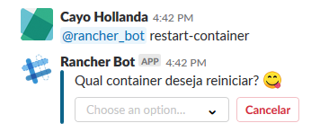
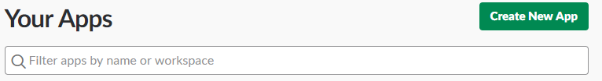
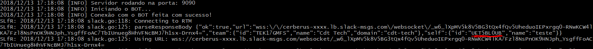

# Slack-bot for Rancher

- [Como funciona?](#como-funciona)
- [Como usar?](#como-usar)
- [Comandos disponíveis](#comandos-disponíveis)

O ***SLfR*** (Slack-bot for Rancher), é uma aplicação responsável pela automação de tarefas no Rancher 1.6, utilizando a API do Rancher e Slack.

O intuito do bot é facilitar tarefas que são comuns a usuários do Rancher, tais como: 

    - Verificar saúde de containers
    - Poder fazer restart de containers
    - Getlogs 
    - Saúde dos servers
    - Upgrades

## Como funciona?

Para entender melhor com funciona um bot dentro do slack, saiba mais aqui [Slack-bot](https://api.slack.com/bot-users) .

Duas das funcionalidades que o BOT provém são o ***@rancher_bot restart-container*** e ***@rancher_bot logs-container***. Ao chamar o bot passando qualquer uma das funcionalidades, o retorno será algo como isto: 



O bot retornará para você uma lista de containers rodando no seu enviromment, que estará definido no arquivo **.env**. 
A aplicação está dockerizada a fim de agilizar a execução e facilitar sua escalabilidade, caso haja necessidade.

Tendo em vista o funcionamento de bot's no slack, levantamos uma API para disponibilizar a sua URI ao slack, que é onde acontecerá as interpretações das ***Actions*** cadastradas para o bot.

## Como usar?

Primeiramente, vamos acessar o site de <a href="https://api.slack.com/apps" target="_blank">APPS do Slack</a>, você cairá em uma página mais ou menos assim:



Vamos clicar em **Create New App**, irá abrir uma janela pedindo **App Name** que você colocará o nome da sua aplicação, e **Development Slack Workspace** que você colocará onde sua app irá funcionar, que no caso, será no seu servidor Slack. Após isso, clique em **Create App**

Após isso, você irá ser redirecionado para o menu da sua aplicação, vá até a opção **OAuth & Permissions**, em Scopes > Select Permission Scopes você deverá selecionar as permissões que sua aplicação terá, recomendamos que coloque a permissão **Administer the workspace**, para que a aplicação tenha acesso e permissão para tudo dentro do Slack, mas caso seu servidor seja mais criterioso, coloque as permissões como preferir. Lembre-se que as permissões que você colocar podem influenciar no funcionamento do BOT.

Após colocar a permissão, a parte de **Scopes** ficará algo parecido com isso:


Basta clicar em **Save Changes** para salvar o que foi feito.

Após isso, vá na opção **Bot Users** e clique em **Add a Bot User** para adicionar um novo BOT à sua aplicação, personalize o nome que será mostrado e o usuário, e clique em **Save Changes**

Feito isso, volte em **Basic Information** no menu e procure por **Install your app to your workspace**, clique nesta opção, veja que irá mostrar algumas informações junto do botão **Install App to Workspace**, clique no botão. Ao clicar no botão para instalar a aplicação no seu servidor, abrirá uma página pedindo para você autorizar a aplicação, clique em **Authorize**

Para usar o ***SLfR*** é simples, primeiro você terá de baixar o código-fonte (fazendo o clone deste repositório)
```console
slack-bot@pc:~$ git clone https://github.com/cayohollanda/slack-bot-rancher.git
```
Após isso, altere o arquivo ```.env``` adicionando as informações do Rancher 1.6, BOT e porta HTTP que rodará a API
```properties
RANCHER_ACCESS_KEY=<ACCESS_KEY_DA_API_DO_RANCHER>
RANCHER_SECRET_KEY=<SECRET_KEY_DA_API_DO_RANCHER>
RANCHER_BASE_URL=<URL_BASE_DA_API> Ex.: http://seu.ip:8080/v1/projects
RANCHER_PROJECT_ID=<ID_DO_ENVIRONMENT_BASE>
SLACK_BOT_TOKEN=<TOKEN_DE_ACESS_DA_APP_DO_SLACK>
SLACK_BOT_ID=<ID_DA_APP>
SLACK_BOT_CHANNEL=<CANAL_ONDE_O_BOT_IRÁ_ESCUTAR_OS_COMANDOS>
SLACK_BOT_VERIFICATION_TOKEN=<CODIGO_DE_VERIFICACAO_DO_BOT>
HTTP_PORT=<PORTA_HTTP_ONDE_IRÁ_RODAR_A_API>
```

**Obs.: Para pegar o ID do BOT, você precisará antes deixá-lo em branco e rodar a aplicação (que será ensinado abaixo), você pegará o ID do BOT nos logs da aplicação, como na imagem abaixo.**



Com o arquivo ```.env``` alterado, você precisará decidir de que forma irá rodar, se deseja rodar na máquina onde está conectado, ou se deseja ***dockerizar***. Caso deseje rodar direto na máquina, basta executar os arquivos ```.go```, da seguinte forma:
```console
slack-bot@pc:~$ go run *.go
```
Caso deseje ***dockerizar***, basta fazer o build da imagem Docker, nosso ```Dockerfile``` já vem pronto para ser buildado:
```console
slack-bot@pc:~$ docker build -t usuario/nome-da-imagem:versao .
```
E após isso, basta dar o ***docker run*** na sua imagem já buildada:
```console
slack-bot@pc:~$ docker run -d -p PORTA_HTTP:PORTA_HTTP -e "FILE=.env" usuario/nome-da-imagem:versao
```
Lembre-se de externalizar a porta HTTP que você definiu no ```.env```, para que assim, o Slack API possa acessar a URL.

**Pronto, agora o BOT já estará rodando, basta verificar no canal do Slack que você definiu para ele ouvir as mensagens se ele enviou a mensagem avisando que está online, e basta usá-lo! :blush:**

## Comandos disponíveis

| Comando | Descrição |
| ------- | --------- |
| `restart-container` | *Comando responsável por fazer o reinício do container especificado* |
| `logs-container` | *Comando responsável por retornar os logs do container especificado até o momento que for acionada a ação* |
| `haproxy-update` | *Comando que faz alteração nos pesos do Canary Deployment* |
| `lb-list` | Comando que trás a lista de ID \| Nome dos Load Balancers do Environment |
| `comandos` | Comando responsável por mostrar os comandos que estão disponíveis no BOT |
